# Frontend Mentor - Multi-step form solution

Esse desafio foi proposto pelo [Frontend Mentor](https://www.frontendmentor.io/challenges/multistep-form-YVAnSdqQBJ/hub). 

## Table of contents

- [Overview](#overview)
  - [O Desafio](#o-desafio)
  - [Screenshot](#screenshot)
  - [Links](#links)
- [Meu Processo](#meu-processo)
  - [Feito com](#feito-com)
  - [Oque eu  aprendi](#oque-eu-aprendi)
- [Autor](#autor)


## Overview

Uma SPA muito desafiadora, onde o uso do _**REDUX**_ é essencial. Basicamente o projeto foi montar uma SPA de assinatura de um plano com um forms (com validação) onde as informações do forms alteravam a aplicação. O uso do _**REDUX**_ foi essencial para aplicação, tanto para paginação quanto para modelagem do conteúdo de acordo com os inputs do usuário. o  _**REACT-HOOK-FORM**_ foi muito util para a validação. Foi muito usado  _**SASS**_ para estilização. tudo foi construído no ambiente  _**VITE**_.


### O Desafio

O Usuário deve:

- Completar cada passo do formulário
- Voltar cada passo e alterar as informações
- Ver o valor de todos os inputs em um form final, calculando o resultado
- Ser responsivo
- Design interativo
- Receber a validação do forms se:
  - Um input estiver vazio
  - A formatação do email estiver errada

### Screenshot

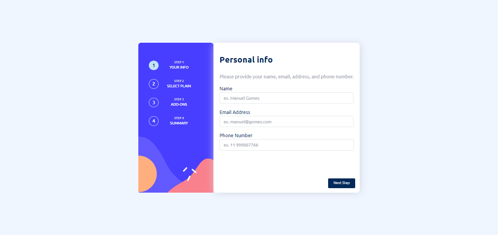
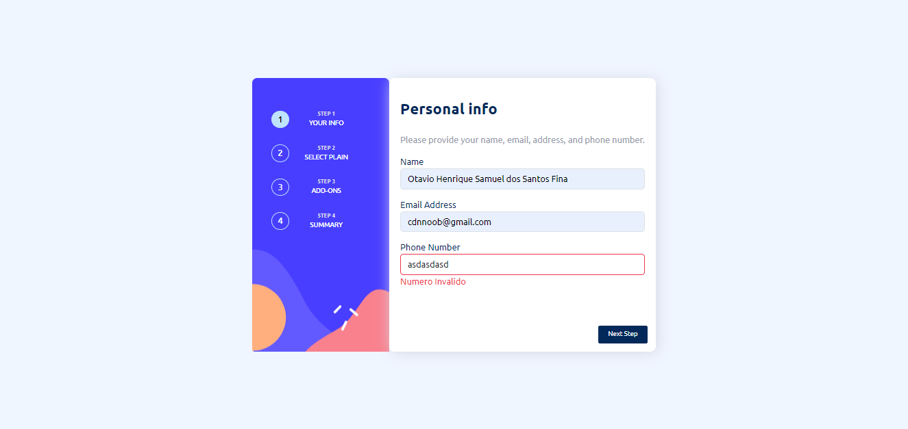
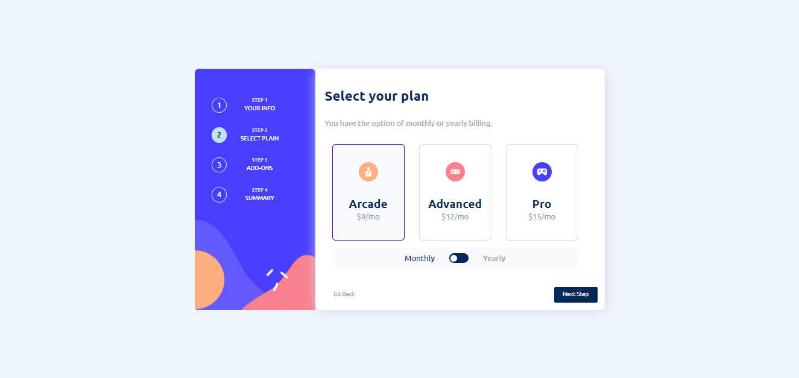
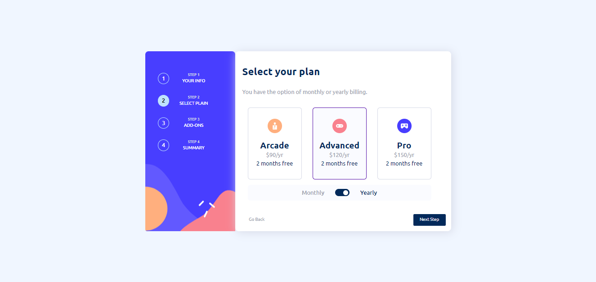
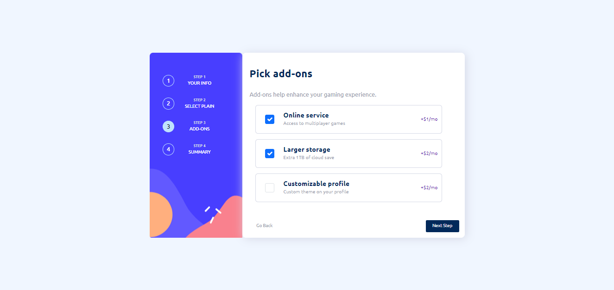
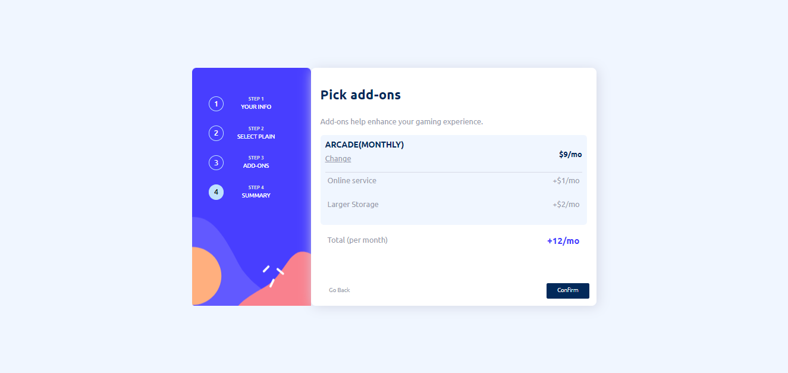
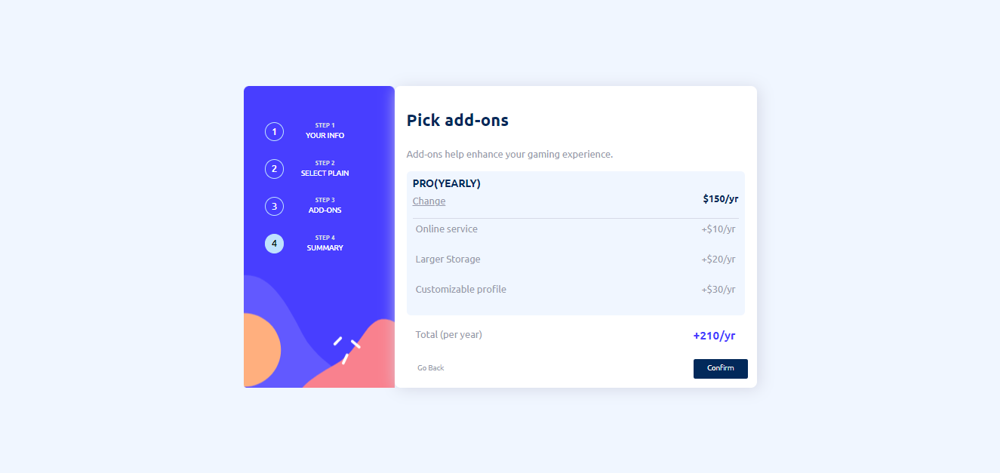
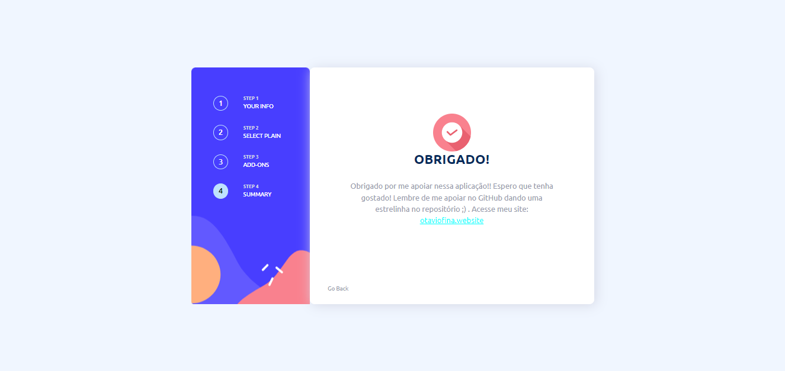

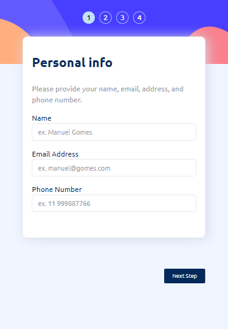
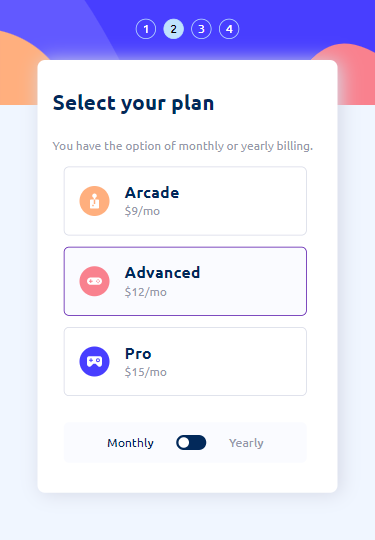
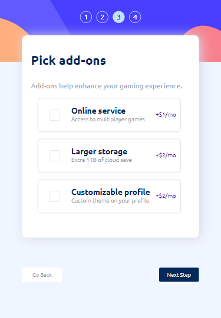
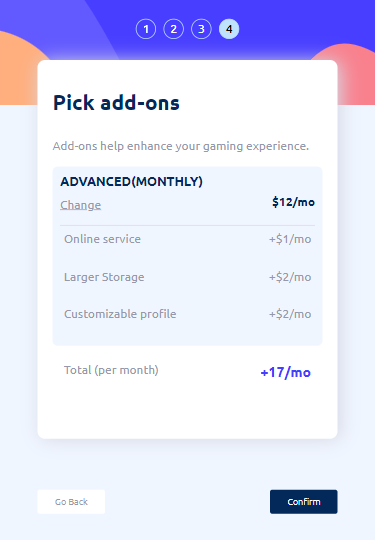
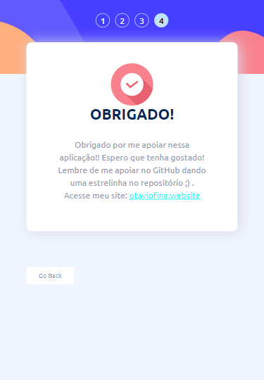


### Links

- Live Site URL: [Add live site URL here](https://your-live-site-url.com)

## Meu processo

### Feito Com

- 
- 
- 
- 
- 
- 
- 
- 
- 
- 
- 
- 
- 
- 
- 


### Oque eu aprendi


Meus códigos mais interessantes:


Uma paginação usando redux
```JSX

  const pagination = useSelector((state:RootState) => state.infoData.pagination)

  function Page() {
    switch (pagination) {
      case 1:
        return <Form1 />
      case 2:
        return <Form2 />
      case 3:
        return <Form3 />
      case 4:
        return <Form4 />
      case 5:
        return <Form5 />
      default:
        return <Form1 />
    }
  }

```
```js
const handleClickNext = () => {
        dispatch(getPagination(4))
      }

      const handleClickBack = () => {
        dispatch(getPagination(2))
      }
```

também há uma alteração de switchs ao clique e reconhecimento da posição dos switchs quando o user volta para a pagina

```JSX
 useEffect(() => {
      
        if (switchPlain) { 
            document.getElementById('switch-plain').style.justifyContent = "flex-start";
            document.getElementById('switch-yearly').className = ''
            document.getElementById('switch-monthly').className = 'active-span-switch'
        } else { 
            document.getElementById('switch-plain').style.justifyContent = "flex-end";
            document.getElementById('switch-monthly').className = ''
            document.getElementById('switch-yearly').className = 'active-span-switch'
        }
    }, []) 
    

    function HandleSwitchPlainClick(e:Event) {
        e.preventDefault();

        if (switchPlain) { 
            document.getElementById('switch-plain').style.justifyContent = "flex-end";
            document.getElementById('switch-yearly').className = 'active-span-switch'
            document.getElementById('switch-monthly').className = ''
            setSwitchPlain(false)
            dispatch(getPlainStyle(false));
        } else {
            document.getElementById('switch-plain').style.justifyContent = "flex-start";
            document.getElementById('switch-monthly').className = 'active-span-switch'
            document.getElementById('switch-yearly').className = ''
            setSwitchPlain(true)
            dispatch(getPlainStyle(true));
        }
    }
```


Além disso, há alguns códigos que dependem de inputs que sobem em variaveis globais no REDUX para informações personalizadas

```JSX
<div className="form-check">
  <input onClick={(e) => {handleClickOnline(e)}} className="form-check-input" type="checkbox" value="" id="check-online-service" checked={infoData.onlineService} />
      <label className="form-check-label" htmlFor="check-online-service">
        <div className='plan-info'>
           <h4>Online service</h4>
           <p>Access to multiplayer games</p>
        </div>
      </label>
      {infoData.styleOfPlain ? <p className='cost-label'>+$1/mo</p>:<p className='cost-label'>+$10/yr</p>}
</div>
```

Tambem há uma validação usando o _**REACT-HOOK-FORM**_ 

```JSX
const schema = yup.object({
    name: yup.string().required(),
    email: yup.string().email().required(),
    phone: yup.number().integer().positive().required()
  }).required();
  type FormData = yup.InferType<typeof schema>;
```

```JSX
const { register, handleSubmit, formState: { errors } } = useForm<FormData>({
        resolver: yupResolver(schema)
      });
```

```JSX
const { register, handleSubmit, formState: { errors } } = useForm<FormData>({
        resolver: yupResolver(schema)
      });
```

```JSX
const onSubmit = (data: FormData) => {
        dispatch(getName(data.name))
        dispatch(getEmail(data.email))
        dispatch(getPhone(data.phone))
        dispatch(getPagination(2))
    }
```


_Eu aprendi muito com com o projeto. O uso muito frequente de variaveis globais fez eu melhorar MUITO minhas abilidades no **REDUX**. Além da validação usando **REACT-HOOK-FORM**_
_e estrutura de pastas com base no ambiente **REACT**. Também melhorei minha construção de paginação de **SPA's** usando **REDUX**_

Ainda há muitos códigos bem interessantes, mas tbm n quero fazer um baita E-BOOK aqui kkk então pode dar uma olhada no código e ver como as coisas funcionam


## Autor

- Website - [otaviofina.website](https://otaviofina.website)
- GitHub - [github.com/Otavio-Fina](https://github.com/Otavio-Fina)
- Linkedin - [www.linkedin.com/in/otavio-fina/](https://www.linkedin.com/in/otavio-fina/)


